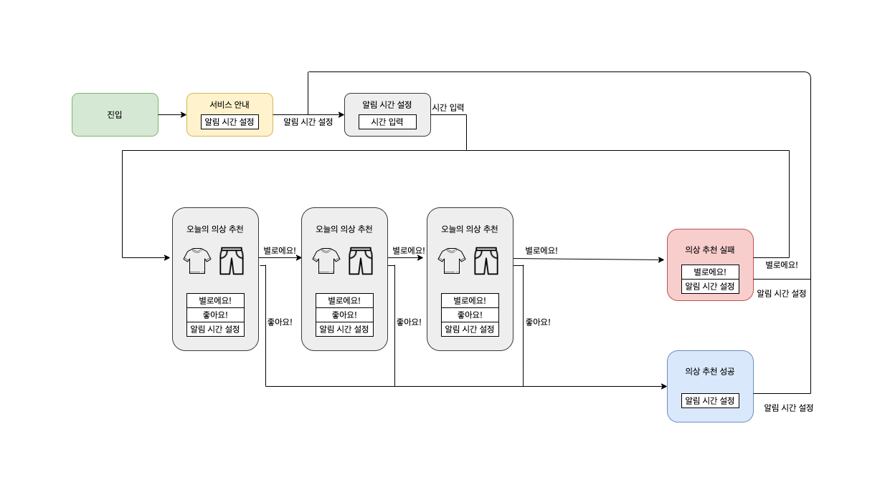
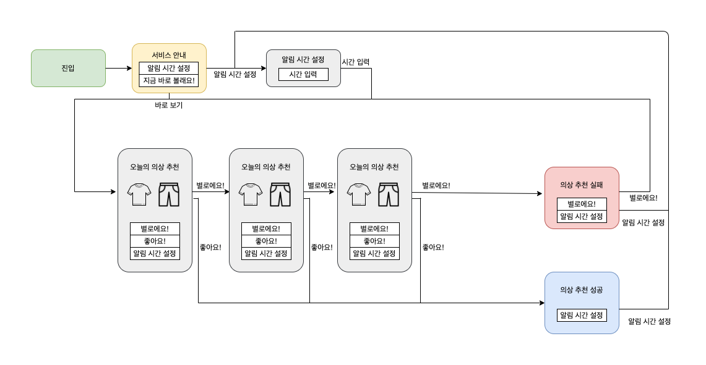

# 오늘 뭐 입지?

---------------------------

### 프로젝트 소개

'오늘 뭐입지?'는 기온에 따라 알맞은 의상을 추천해주는 챗봇입니다. 챗봇은 매일 기온을 알아내어 적절한 의상을 추천해줍니다. 사용자는 알림 시간을 설정하여 서비스를 간편히 사용할 수 있습니다. 

### 시나리오 

  <figure>
      
      
<figcation>챗봇 시나리오</figcation>

### 기여자

* 허승우
* 이소민
* 이상현
* 이정우
* 신봉근
